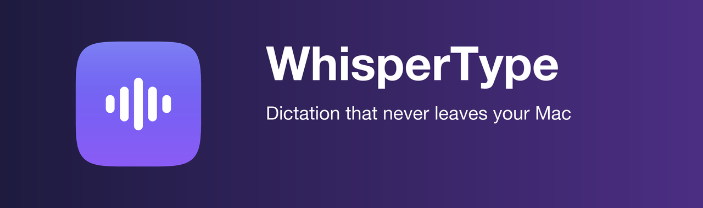

<div align="center">



[](#requirements)
[](#requirements)
[](https://github.com/ml-explore/mlx-examples)
[](LICENSE)

**Double-tap a key. Speak. Watch the text appear wherever your cursor is.**

[Русская документация →](README.ru.md)

</div>

---

WhisperType is a tiny menu-bar app that turns your voice into text in any input
field — chat, editor, browser, terminal. Speech recognition runs **entirely
on-device** on the Apple GPU via
[MLX Whisper](https://github.com/ml-explore/mlx-examples): audio never touches
the network, is never written to disk, and lives in RAM only for the few
seconds it takes to transcribe.

## Why another dictation app?

- **Private by physics, not by policy.** No account, no API key, no cloud.
  Unplug your network cable — dictation still works.
- **Fast where it matters.** A short phrase transcribes in ~1.3 s. Long
  dictations are transcribed *while you are still speaking* — chunks are cut at
  natural pauses and processed in the background, so a full minute of speech
  appears ~1.3 s after you stop, not 5+.
- **Works everywhere.** Text is inserted through the clipboard with a synthetic
  ⌘V — the only method that survives any app, any keyboard layout, and
  non-Latin scripts. Your previous clipboard is restored automatically.
- **Stays out of the way.** One menu-bar icon. Double-tap right ⌘ to start,
  double-tap to stop, Esc to cancel. No windows, no Dock icon.

## Requirements

- Mac with Apple Silicon (M1 or newer) — recognition runs on the Apple GPU
- macOS 13+
- [Homebrew](https://brew.sh) (the installer uses it to fetch Python if needed)
- ~1 GB of disk: the recognition model (~0.5 GB, downloaded once) + Python env

## Install

```bash
git clone https://github.com/maxecho/whispertype.git
cd whispertype
./install.sh
```

The script builds `WhisperType.app`, puts it into /Applications, downloads the
model and enables launch-at-login. First run takes a few minutes.

macOS will ask for two one-time permissions, and the app walks you through
both: **Accessibility** (to catch the hotkey and type for you) and
**Microphone**. No restarts needed — the app picks the permission up within
seconds of you granting it.

## Use

1. Put the cursor where you want the text.
2. **Double-tap right ⌘** — the menu-bar wave turns red, a timer starts.
3. Speak.
4. **Double-tap right ⌘ again** — the text appears by itself.

Changed your mind mid-sentence? Press **Esc** — the recording is discarded.

| Menu-bar icon | Meaning |
|---|---|
| wave | ready |
| red wave + timer | recording |
| wave + dots | transcribing |
| wave + `!` | missing permission / something failed |

Everything configurable lives in the menu: five hotkey presets (switched
on the fly), language (Russian / English / auto-detect), auto-paste toggle,
sounds, launch at login — plus built-in help and a self-diagnosing
"something's wrong" dialog.

> **Note:** the app UI is currently Russian-only. Recognition itself handles
> [90+ languages](https://github.com/openai/whisper#available-models-and-languages) —
> pick yours in the Language menu.

### Power-user settings

`~/Library/Application Support/WhisperType/settings.json` (picked up on
restart):

- `initial_prompt` — comma-separated names and jargon the model tends to
  mangle: company names, colleagues, domain terms. Dramatically improves
  recognition of your vocabulary.
- `model` — default is `mlx-community/whisper-large-v3-turbo-q4`. On 16+ GB
  machines you may switch to the full `mlx-community/whisper-large-v3-turbo`,
  though speed and accuracy are practically identical.
- `hotkey.combo` — any modifier chord (e.g. `"<ctrl>+<alt>+d"`) if you prefer
  a combo over double-tap.

## Speed & footprint

| | |
|---|---|
| Short phrase (5 s) | ~1.3 s |
| One minute of speech | ~1.3 s after you stop (streamed during recording) |
| Idle CPU | ~0.1 % |
| RAM | ~0.5 GB, wired |

The quantized q4 model is the default *not* for speed — benchmarks
(`tools/bench.py`) show it ties the full model — but for memory. On an 8 GB
Mac the 2.2 GB full model gets swapped out between dictations, and every
dictation after a pause would start with seconds of reloading weights from
disk. The q4 weights are 4× smaller and additionally **wired into memory**
(`mx.set_wired_limit`), so dictation always starts hot.

## Troubleshooting

Start with the **"Что-то не работает"** menu item — it checks permissions,
microphone and the model, and offers the fix.

CLI diagnostics:

```bash
/Applications/WhisperType.app/Contents/MacOS/WhisperType doctor
```

Also available: `tapcheck` (the app presses its own hotkey and verifies the
event arrives), `devices` (list microphones), `selftest 5` (record 5 seconds
and print the transcript).

**Caveat:** `doctor` run from a terminal will report "no accessibility
permission" even when it's granted — macOS attributes permissions to the
terminal, not the app. The menu-item check is the authoritative one.

After `brew upgrade python@3.x`, rebuild: `./install.sh`.

## How it's built

| File | Role |
|---|---|
| `whisperapp/branding.py` | name, colors, every user-facing string |
| `whisperapp/hotkey.py` | global hotkey via a raw CGEventTap |
| `whisperapp/recorder.py` | 16 kHz mono capture into RAM |
| `whisperapp/transcriber.py` | MLX Whisper + hallucination filter + streaming chunker |
| `whisperapp/inserter.py` | clipboard + synthetic ⌘V |
| `whisperapp/app.py` | menu-bar UI and state machine |
| `whisperapp/autostart.py` | LaunchAgent |
| `tools/make_icons.py` | the whole identity, generated from code |

Tests run without a microphone, keyboard or permissions — speech is
synthesized with the system TTS voice, hotkey events are injected directly,
and UI strings are checked for leaked absolute paths:

```bash
.venv/bin/python test_texts.py && .venv/bin/python test_hotkey.py && \
  .venv/bin/python test_pipeline.py && .venv/bin/python test_streaming.py
```

### Engineering notes (learned the hard way)

**The hotkey listener is a raw CGEventTap, not pynput.** On macOS 26, pynput
queries the keyboard layout via HIToolbox from a background thread; HIToolbox
now demands the main thread and kills the process with SIGTRAP on the first
keypress. Key *codes* are layout-independent, so the query isn't needed at
all. The tap is listen-only — normal shortcuts keep working.

**Long dictations are chunked while recording.** Every ~22 s the accumulated
audio is cut at the quietest 200 ms stretch of the last few seconds (so words
are never split), transcribed in a background thread, and the next chunk
receives the tail of the previous text as a prompt for continuity. After you
stop, only the tail remains.

**Don't try windows shorter than 30 s.** The tempting optimization — slicing
the encoder's positional embeddings to the actual clip length instead of
padding to 30 s — makes whisper-turbo loop and hallucinate on noise, with and
without timestamps. The model only ever saw 30-second windows in training.
Benchmarked, confirmed, abandoned.

## Uninstall

```bash
./uninstall.sh
```

## License

[MIT](LICENSE). Built on [MLX](https://github.com/ml-explore/mlx) and
[Whisper](https://github.com/openai/whisper) — thanks to both teams.
