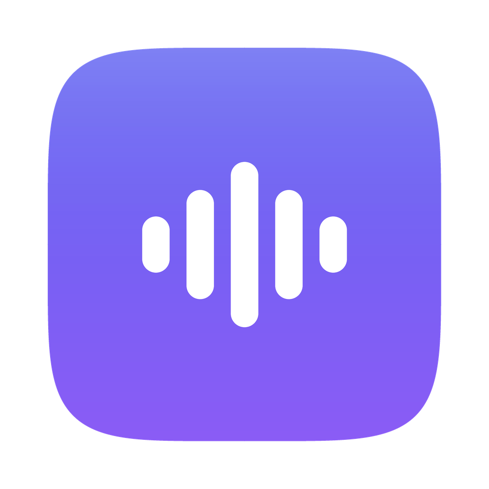
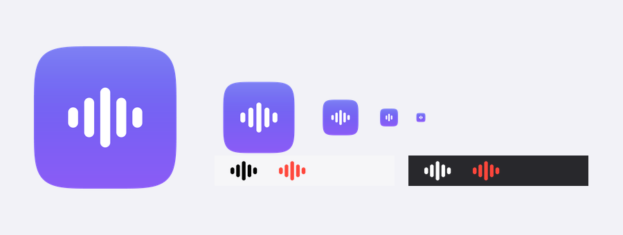

<div align="center">



# Whisper

**Диктовка, которая не покидает ваш мак**



</div>

Нажали клавишу — сказали — текст появился там, где стоял курсор.
Распознавание целиком считается на вашем маке, на чипе Apple: запись не уходит
в сеть, не сохраняется на диск и живёт в оперативной памяти несколько секунд.

Нужен **Mac на чипе Apple** (M1 и новее) и macOS 13 или свежее.

## Установка

```bash
./install.sh
```

Скрипт соберёт `Whisper.app`, положит его в «Программы», скачает распознавание
(~1.6 ГБ, один раз) и включит запуск при входе в систему. Первый прогон занимает
несколько минут.

Дальше программа сама попросит два разрешения:

- **нажимать клавиши за вас** — без этого не сработает ни горячая клавиша, ни
  вставка текста. Whisper откроет нужную панель настроек, останется включить
  галочку. Перезапускать ничего не нужно: разрешение подхватится за пару секунд;
- **микрофон** — обычное системное окно при первом запуске.

## Как пользоваться

1. Поставьте курсор туда, где хотите видеть текст.
2. **Дважды нажмите ⌘ справа** — значок в строке меню станет красным.
3. Говорите.
4. **Дважды нажмите ⌘ справа ещё раз** — текст появится сам.

Передумали посреди фразы — **Esc**, запись просто исчезнет.

Значок в строке меню показывает, что происходит:

| Значок | Что значит |
|---|---|
| волна | ждёт |
| красная волна и таймер | записывает |
| волна и точки | разбирает сказанное |
| волна и `!` | нет разрешения или что-то не вышло |

## Настройки

Всё, что стоит менять, есть в меню самой программы:

- **Горячая клавиша** — пять готовых вариантов, переключаются на лету.
- **Язык** — русский, английский или определять самому.
- **Вставлять сразу в поле** — если выключить, текст просто ложится в буфер обмена.
- **Звук в начале и в конце**.
- **Запускать при входе**.

Там же — «Как этим пользоваться» и «Что-то не работает» с живой проверкой
разрешений, микрофона и распознавания.

### Тонкие настройки

`~/Library/Application Support/Whisper/settings.json`, изменения подхватываются
при следующем запуске. Оттуда полезны два ключа:

- `initial_prompt` — подсказка распознаванию с именами и терминами, которые оно
  путает: названия компаний, фамилии коллег, профессиональный жаргон. Просто
  перечислите их через запятую.
- `model` — `mlx-community/whisper-large-v3-turbo-q4` вместо обычного варианта
  занимает примерно вдвое меньше памяти ценой небольшой потери точности.

## Что делать, если не работает

Сначала — пункт «Что-то не работает» в меню программы: он проверяет всё сам
и предлагает починку.

Если хочется подробностей:

```bash
/Applications/Whisper.app/Contents/MacOS/Whisper doctor
```

Ещё есть `tapcheck` (программа сама нажимает клавишу и проверяет, дошло ли),
`devices` (список микрофонов) и `selftest 5` (записать 5 секунд и показать
расшифровку).

**Важно:** запущенный из терминала `doctor` покажет, что разрешения нет, даже
когда оно есть. Так работает macOS: у программы, запущенной из терминала,
права считаются по терминалу, а не по ней самой. Настоящую проверку делает пункт
меню «Что-то не работает».

**После `brew upgrade python@3.12`** соберите приложение заново — `./install.sh`.

## Скорость и ресурсы

Короткая фраза расшифровывается за ~1.3 секунды. Длинные диктовки режутся по
паузам и расшифровываются прямо во время записи, поэтому ожидание после
остановки не растёт с длиной: минута речи — те же ~1.3 секунды (без этого было
бы ~5).

В простое — около 0.1% процессора. Памяти ~2 ГБ: распознавание держится
загруженным, чтобы не ждать загрузку на каждой фразе. Хочется меньше —
переключите `model` на вариант `-q4` (памяти вдвое меньше, скорость та же).

## Удаление

```bash
./uninstall.sh
```

## Как устроено

| Файл | Что делает |
|---|---|
| `whisperapp/branding.py` | название, цвета и все тексты, которые видит человек |
| `whisperapp/hotkey.py` | перехват горячей клавиши через CGEventTap |
| `whisperapp/recorder.py` | запись с микрофона в память, 16 кГц моно |
| `whisperapp/transcriber.py` | распознавание на MLX и отсев выдумок на тишине |
| `whisperapp/inserter.py` | буфер обмена и синтетическое ⌘V |
| `whisperapp/app.py` | значок в строке меню и состояния программы |
| `whisperapp/autostart.py` | запуск при входе в систему |
| `tools/make_icons.py` | рисует иконки из кода |
| `setup.py` | сборка `Whisper.app` |

Тесты — `test_hotkey.py` (распознавание клавиши, без клавиатуры и разрешений),
`test_pipeline.py` (расшифровка синтезированной речи, без микрофона) и
`test_streaming.py` (расшифровка кусками: корректность склейки, задержка хвоста,
отсутствие потерь звука):

```bash
.venv/bin/python test_hotkey.py && .venv/bin/python test_pipeline.py && .venv/bin/python test_streaming.py
```

### Три решения, которые стоит помнить

**Длинные диктовки расшифровываются кусками во время записи.** Каждые ~22
секунды накопленный звук режется в ближайшей паузе (ищется самый тихий участок,
чтобы не резать по слову) и уходит в фоновый поток; следующий кусок получает
хвост предыдущего текста как подсказку, чтобы модель продолжала мысль. После
остановки остаётся только хвост. Квантованная q4-модель, кстати, не быстрее
обычной — проверено бенчмарком (`tools/bench.py`), накладные на распаковку
весов съедают выигрыш.

**Перехват клавиш написан на голом CGEventTap, без pynput.** pynput на macOS 26
спрашивает у HIToolbox текущую раскладку из фонового потока, а тот с некоторых
пор требует главный, — и роняет процесс по SIGTRAP на первом же нажатии. Нам
раскладка не нужна: коды клавиш от неё не зависят. События мы не съедаем
(listen-only), поэтому обычные шорткаты продолжают работать.

**Вставка идёт через буфер обмена и ⌘V**, а не посимвольным набором: это
единственный способ, надёжно работающий с кириллицей в любой раскладке и в любом
приложении. Прежнее содержимое буфера возвращается через полсекунды.

**Двойное нажатие ⌥ занято Claude** (быстрый ввод), а Caps Lock — его же
диктовкой. Поэтому по умолчанию выбран ⌘ справа.
